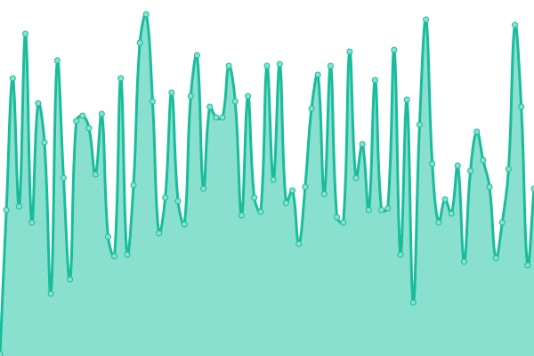
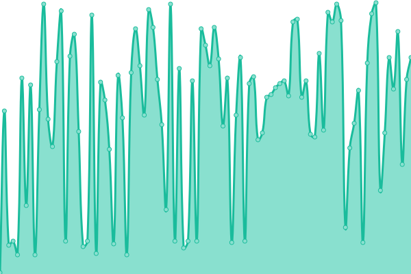
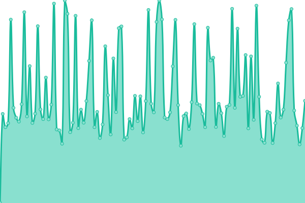
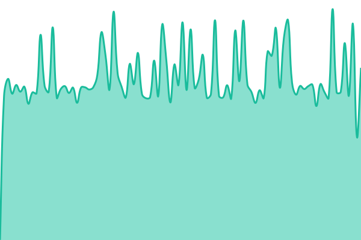
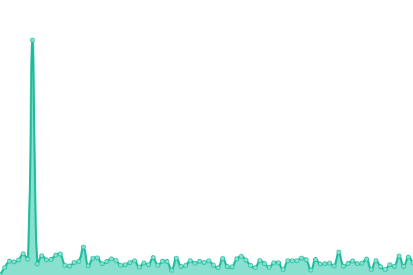

# [📈 Live Status](https://soumyak4.in): <!--live status--> **🟩 All systems operational**

This repository contains the open-source uptime monitor and status page for [Soumya Kundu](status.soumyak4.in), powered by [Upptime](https://github.com/upptime/upptime).

With [Upptime](https://upptime.js.org), you can get your own unlimited and free uptime monitor and status page, powered entirely by a GitHub repository. We use [Issues](https://github.com/SoumyaK4/Uptime/issues) as incident reports, [Actions](https://github.com/SoumyaK4/Uptime/actions) as uptime monitors, and [Pages](https://status.soumyak4.in) for the status page.

<!--start: status pages-->
<!-- This summary is generated by Upptime (https://github.com/upptime/upptime) -->
<!-- Do not edit this manually, your changes will be overwritten -->
<!-- prettier-ignore -->
| URL | Status | History | Response Time | Uptime |
| --- | ------ | ------- | ------------- | ------ |
|  [Portfolio](https://soumyak4.in/) | 🟩 Up | [portfolio.yml](https://github.com/SoumyaK4/Uptime/commits/HEAD/history/portfolio.yml) | 

 126ms
     
 | 

<a href="https://status.soumyak4.in/history/portfolio">100.00%</a>
    

|  [Weiqi Roadmap](https://weiqi.soumyak4.in/) | 🟩 Up | [weiqi-roadmap.yml](https://github.com/SoumyaK4/Uptime/commits/HEAD/history/weiqi-roadmap.yml) | 

 134ms
     
 | 

<a href="https://status.soumyak4.in/history/weiqi-roadmap">100.00%</a>
    

|  [BadukTube](https://baduktube.soumyak4.in/about) | 🟩 Up | [baduk-tube.yml](https://github.com/SoumyaK4/Uptime/commits/HEAD/history/baduk-tube.yml) | 

 453ms
     
 | 

<a href="https://status.soumyak4.in/history/baduk-tube">100.00%</a>
    

|  [TsumeGod](https://tsumegod.soumyak4.in/) | 🟩 Up | [tsume-god.yml](https://github.com/SoumyaK4/Uptime/commits/HEAD/history/tsume-god.yml) | 

 1362ms
     
 | 

<a href="https://status.soumyak4.in/history/tsume-god">100.00%</a>
    

|  [Association of Indian Go Players](https://aigp.org.in/) | 🟩 Up | [association-of-indian-go-players.yml](https://github.com/SoumyaK4/Uptime/commits/HEAD/history/association-of-indian-go-players.yml) | 

 143ms
     
 | 

<a href="https://status.soumyak4.in/history/association-of-indian-go-players">100.00%</a>
    

<!--end: status pages-->

[**Visit our status website →**](https://soumyak4.in)

## 📄 License

- Powered by: [Upptime](https://github.com/upptime/upptime)
- Code: [MIT](./LICENSE) © [Anand Chowdhary](https://anandchowdhary.com), supported by [Pabio](https://pabio.com)
- Data in the `./history` directory: [Open Database License](https://opendatacommons.org/licenses/odbl/1-0/)
