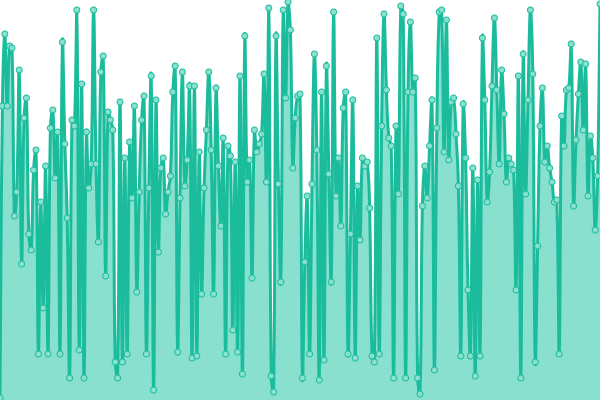

# [📈 Live Status](https://soumyak4.in): <!--live status--> **🟩 All systems operational**

This repository contains the open-source uptime monitor and status page for [Soumya Kundu](weiqi.soumyak4.in), powered by [Upptime](https://github.com/upptime/upptime).

With [Upptime](https://upptime.js.org), you can get your own unlimited and free uptime monitor and status page, powered entirely by a GitHub repository. We use [Issues](https://github.com/SoumyaK4/Upptime/issues) as incident reports, [Actions](https://github.com/SoumyaK4/Upptime/actions) as uptime monitors, and [Pages](https://soumyak4.in) for the status page.

<!--start: status pages-->
<!-- This summary is generated by Upptime (https://github.com/upptime/upptime) -->
<!-- Do not edit this manually, your changes will be overwritten -->
<!-- prettier-ignore -->
| URL | Status | History | Response Time | Uptime |
| --- | ------ | ------- | ------------- | ------ |
|  [SoumyaK4](https://soumyak4.in/) | 🟩 Up | [soumya-k4.yml](https://github.com/SoumyaK4/Uptime/commits/HEAD/history/soumya-k4.yml) | 

 94ms
     
 | 

<a href="https://soumyak4.in/history/soumya-k4">100.00%</a>
    

|  [Weiqi Roadmap](https://weiqi.soumyak4.in/) | 🟩 Up | [weiqi-roadmap.yml](https://github.com/SoumyaK4/Uptime/commits/HEAD/history/weiqi-roadmap.yml) | 

 113ms
     
 | 

<a href="https://soumyak4.in/history/weiqi-roadmap">100.00%</a>
    

|  [Baduk Tube](https://baduklectures.soumyak4.in/) | 🟩 Up | [baduk-tube.yml](https://github.com/SoumyaK4/Uptime/commits/HEAD/history/baduk-tube.yml) | 

 344ms
     
 | 

<a href="https://soumyak4.in/history/baduk-tube">100.00%</a>
    

<!--end: status pages-->

[**Visit our status website →**](https://soumyak4.in)

## 📄 License

- Powered by: [Upptime](https://github.com/upptime/upptime)
- Code: [MIT](./LICENSE) © [Anand Chowdhary](https://anandchowdhary.com), supported by [Pabio](https://pabio.com)
- Data in the `./history` directory: [Open Database License](https://opendatacommons.org/licenses/odbl/1-0/)
